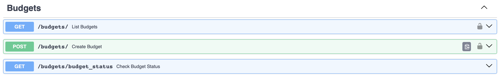

# Задание 1

Реализация серверного приложения FastAPI

- Язык реализации: Python

## Практики
- Pr 1.1 <https://github.com/anyashishkina/ITMO_ICT_WebDevelopment_tools_2024-2025/tree/main/students/k3343/Shishkina_Anna/pr1.1>
- Pr 1.2 <https://github.com/anyashishkina/ITMO_ICT_WebDevelopment_tools_2024-2025/tree/main/students/k3343/Shishkina_Anna/pr1.2>
- Pr 1.3 <https://github.com/anyashishkina/ITMO_ICT_WebDevelopment_tools_2024-2025/tree/main/students/k3343/Shishkina_Anna/pr1.3>

## Эндпоинты
- Регистрация, вход, получение информации о пользователе, смена пароля

```python
@router.post("/register")
def register_user(user: UserCreateWithPassword, session: Session = Depends(get_session)):
    db_user = session.exec(select(User).filter(User.email == user.email)).first()
    if db_user:
        raise HTTPException(status_code=400, detail="Пользователь с таким email уже существует")
    
    hashed_password = hash_password(user.password)
    db_user = User(email=user.email, full_name=user.full_name, hashed_password=hashed_password, is_active=True)
    session.add(db_user)
    session.commit()
    session.refresh(db_user)
    return db_user

@router.post("/login")
def login_user(
    username: str = Form(...),
    password: str = Form(...),
    session: Session = Depends(get_session)
):
    db_user = session.exec(select(User).filter(User.email == username)).first()
    if db_user is None or not verify_password(password, db_user.hashed_password):
        raise HTTPException(status_code=401, detail="Неверный email или пароль")

    access_token = create_access_token(data={"sub": db_user.email})
    return {"access_token": access_token, "token_type": "bearer"}

@router.get("/me", response_model=UserRead)
def get_me(current_user: User = Depends(get_current_user)):
    return current_user

@router.put("/change_password")
def change_password(new_password: str, current_user: User = Depends(get_current_user), session: Session = Depends(get_session)):
    hashed_password = hash_password(new_password)
    current_user.hashed_password = hashed_password
    session.add(current_user)
    session.commit()
    return {"msg": "Пароль успешно изменен"}
```

- Категории трат 

```python
@router.post("/", response_model=Category)
def create_category(category: Category, session: Session = Depends(get_session), user: User = Depends(get_current_user)):
    category.user_id = user.id
    session.add(category)
    session.commit()
    session.refresh(category)
    return category

@router.get("/", response_model=List[Category])
def list_categories(session: Session = Depends(get_session), user: User = Depends(get_current_user)):
    return session.exec(select(Category).filter(Category.user_id == user.id)).all()

@router.put("/{category_id}", response_model=Category)
def update_category(category_id: int, updated_category: Category, session: Session = Depends(get_session), user: User = Depends(get_current_user)):
    category = session.get(Category, category_id)
    if not category or category.user_id != user.id:
        raise HTTPException(status_code=404, detail="Категория не найдена")
    if category.user_id != current_user.id:
        raise HTTPException(status_code=403, detail="У вас нет доступа")
    category.name = updated_category.name
    session.commit()
    session.refresh(category)
    return category

@router.delete("/{category_id}", response_model=Category)
def delete_category(category_id: int, session: Session = Depends(get_session), user: User = Depends(get_current_user)):
    category = session.get(Category, category_id)
    if not category or category.user_id != user.id:
        raise HTTPException(status_code=404, detail="Категория не найдена")
    if category.user_id != current_user.id:
        raise HTTPException(status_code=403, detail="У вас нет доступа")
    session.delete(category)
    session.commit()
    return category
```
- Счета

```python
@router.post("/", response_model=Account)
def create_account(account: Account, session: Session = Depends(get_session), current_user: User = Depends(get_current_user)):
    account.user_id = current_user.id
    session.add(account)
    session.commit()
    session.refresh(account)
    return account

@router.get("/", response_model=List[Account])
def list_accounts(session: Session = Depends(get_session), current_user: User = Depends(get_current_user)):
    return session.exec(select(Account).where(Account.user_id == current_user.id)).all()

@router.put("/{account_id}", response_model=Account)
def update_account(
    account_id: int, 
    account_update: AccountUpdate,
    session: Session = Depends(get_session),
    current_user: User = Depends(get_current_user)
):
    db_account = session.get(Account, account_id)
    if not db_account:
        raise HTTPException(status_code=404, detail="Счет не найден")
    if db_account.user_id != current_user.id: #если введен аккаунт другого пользователя
        raise HTTPException(status_code=403, detail="У вас нет доступа")
    
    # Обновление полей
    if account_update.name is not None:
        db_account.name = account_update.name
    if account_update.balance is not None:
        db_account.balance = account_update.balance
    if account_update.account_type is not None:
        db_account.account_type = account_update.account_type
    
    session.commit()
    session.refresh(db_account)
    return db_account

@router.delete("/{account_id}", response_model=Account)
def delete_account(account_id: int, session: Session = Depends(get_session), current_user: User = Depends(get_current_user)):
    db_account = session.get(Account, account_id)
    if db_account is None:
        raise HTTPException(status_code=404, detail="Счет не найден")
    if db_account.user_id != current_user.id: #если введен аккаунт другого пользователя
        raise HTTPException(status_code=403, detail="У вас нет доступа")
    session.delete(db_account)
    session.commit()
    return db_account
```
- Бюджет на категории трат

```python
@router.post("/", response_model=Budget)
def create_budget(budget: Budget, session: Session = Depends(get_session), current_user: User = Depends(get_current_user)):
    budget.user_id = current_user.id
    session.add(budget)
    session.commit()
    session.refresh(budget)
    return budget

@router.get("/", response_model=List[Budget])
def list_budgets(session: Session = Depends(get_session), current_user: User = Depends(get_current_user)):
    return session.exec(select(Budget).where(Budget.user_id == current_user.id)).all()

@router.get("/budget_status")
def check_budget_status(session: Session = Depends(get_session)):
    budgets = session.exec(select(Budget)).all()
    transactions = session.exec(select(Transaction)).all()

    category_expenses = {}
    for t in transactions:
        if t.type == TransactionType.expense:
            category_expenses[t.category_id] = category_expenses.get(t.category_id, 0) + t.amount

    alerts = []
    for b in budgets:
        spent = category_expenses.get(b.category_id, 0)
        if spent > b.amount:
            alerts.append(f"Превышение бюджета по категории ID {b.category_id}: потрачено {spent}, лимит {b.amount}")

    return {"alerts": alerts}
```
- Отчёты

```python
@router.get("/")
def get_report(session: Session = Depends(get_session)):
    transactions = session.exec(select(Transaction)).all()
    # считаем все доходы и расходы
    total_income = sum(t.amount for t in transactions if t.type == TransactionType.income)
    total_expense = sum(t.amount for t in transactions if t.type == TransactionType.expense)
    return {
        "total_income": total_income,
        "total_expense": total_expense,
        "balance": total_income - total_expense
    }

@router.get("/detailed_report")
def get_detailed_report(session: Session = Depends(get_session)):
    transactions = session.exec(select(Transaction)).all()
    # загружаем категорию и аккаунт для каждой транзакции
    for t in transactions:
        if t.category_id:
            t.category = session.get(Category, t.category_id)
        if t.account_id:
            t.account = session.get(Account, t.account_id)
    
    report = {
        "total_income": sum(t.amount for t in transactions if t.type == TransactionType.income),
        "total_expense": sum(t.amount for t in transactions if t.type == TransactionType.expense),
        "balance": sum(t.amount for t in transactions if t.type == TransactionType.income) - 
                 sum(t.amount for t in transactions if t.type == TransactionType.expense),
        "transactions": [
            {
                "id": t.id,
                "amount": t.amount,
                "date": t.date,
                "description": t.description,
                "type": t.type,
                "category_name": t.category.name if hasattr(t, 'category') and t.category else None, # записываем название категории
                "account_name": t.account.name if hasattr(t, 'account') and t.account else None, # записываю название счёта
            }
            for t in transactions
        ]
    }
    return report
```
## Модели данных
```python 
# Пользователь

class UserBase(SQLModel):
    email: EmailStr
    full_name: Optional[str] = None


class User(UserBase, table=True):
    __tablename__ = "users"
    id: Optional[int] = Field(default=None, primary_key=True)
    hashed_password: str
    is_active: bool = True

    transactions: List["Transaction"] = Relationship(back_populates="user")
    budgets: List["Budget"] = Relationship(back_populates="user")
    categories: List["Category"] = Relationship(back_populates="user")
    accounts: List["Account"] = Relationship(back_populates="user")

# Категории трат
class Category(SQLModel, table=True):
    id: Optional[int] = Field(default=None, primary_key=True)
    name: str

    user_id: int = Field(foreign_key="users.id")
    user: Optional[User] = Relationship(back_populates="categories")
    
    budgets: List["Budget"] = Relationship(back_populates="category")
    transactions: List["Transaction"] = Relationship(back_populates="category")

# Счета
class AccountType(str, Enum):
    checking = "checking"  # Расчетный счет
    savings = "savings"    # Сберегательный счет
    credit = "credit"      # Кредитный счет


class AccountBase(SQLModel):
    user_id: int
    name: str  
    balance: float = 0.0 
    account_type: AccountType


class Account(AccountBase, table=True):
    id: Optional[int] = Field(default=None, primary_key=True)
    user_id: int = Field(foreign_key="users.id")
    user: Optional[User] = Relationship(back_populates="accounts")
    transactions: List["Transaction"] = Relationship(back_populates="account")

class AccountUpdate(SQLModel):
    name: Optional[str] = None
    balance: Optional[float] = None
    account_type: Optional[AccountType] = None

# Транзакции
class TransactionType(str, Enum):
    income = "income" # доход
    expense = "expense" # расход

class TransactionBase(SQLModel):
    amount: float
    date: date
    description: Optional[str] = None
    type: TransactionType
    category_id: Optional[int] = Field(default=None, foreign_key="category.id")
    account_id: Optional[int] = Field(default=None, foreign_key="account.id")

class Transaction(TransactionBase, table=True):
    id: Optional[int] = Field(default=None, primary_key=True)

    user_id: int = Field(foreign_key="users.id")
    user: Optional[User] = Relationship(back_populates="transactions")

    category: Optional[Category] = Relationship(back_populates="transactions")
    account: Optional[Account] = Relationship(back_populates="transactions")


User.accounts = Relationship(back_populates="user")
Transaction.account = Relationship(back_populates="transactions")

# Бюджет на категории
class BudgetBase(SQLModel):
    user_id: int
    amount: float
    category_id: Optional[int] = Field(default=None, foreign_key="category.id")


class Budget(BudgetBase, table=True):
    id: Optional[int] = Field(default=None, primary_key=True)

    user_id: int = Field(foreign_key="users.id")
    user: Optional[User] = Relationship(back_populates="budgets")

    category: Optional[Category] = Relationship(back_populates="budgets")

class UserCreate(UserBase):
    password: str

class UserRead(UserBase):
    id: int
    is_active: bool

class UserCreateWithPassword(UserCreate):
    password: str
```
## Запуск приложения
```python
uvicorn main:app --reload
```
