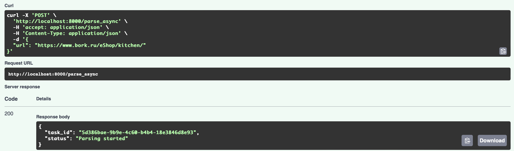
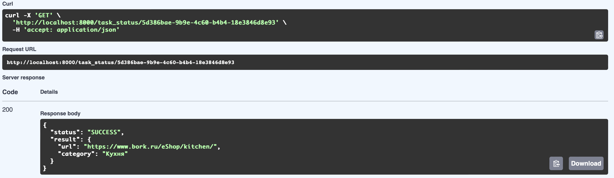

# Задание 3

Упаковка FastAPI приложения в Docker, Работа с источниками данных и Очереди

## Задача 1

Упаковка FastAPI приложения, базы данных и парсера данных в Docker

Dockerfile FastAPI приложения  
```python
FROM python:3.11

WORKDIR /app

COPY ./requirements.txt /app/requirements.txt

RUN pip install --no-cache-dir --upgrade -r /app/requirements.txt

COPY . .

CMD ["uvicorn", "main:app", "--host", "0.0.0.0", "--port", "8000"]
```

Dockerfile FastAPI парсера  

```python
FROM python:3.11

WORKDIR /parser_app

COPY requirements.txt requirements.txt

RUN pip install --no-cache-dir --upgrade -r requirements.txt

COPY . .

CMD ["uvicorn", "parser_app:app", "--host", "0.0.0.0", "--port", "8001"]
```

Файл requirements.txt  
```python
aiohappyeyeballs==2.6.1
aiohttp==3.12.6
aiosignal==1.3.2
alembic==1.15.2
annotated-types==0.7.0
anyio==4.9.0
attrs==25.3.0
bcrypt==4.3.0
certifi==2025.1.31
click==8.1.8
dnspython==2.7.0
email_validator==2.2.0
fastapi==0.115.12
fastapi-cli==0.0.7
frozenlist==1.6.0
h11==0.14.0
httpcore==1.0.8
httptools==0.6.4
httpx==0.28.1
idna==3.10
itsdangerous==2.2.0
Jinja2==3.1.6
Mako==1.3.10
markdown-it-py==3.0.0
MarkupSafe==3.0.2
mdurl==0.1.2
multidict==6.4.4
orjson==3.10.16
passlib==1.7.4
propcache==0.3.1
psycopg2-binary==2.9.10
pydantic==2.11.3
pydantic-extra-types==2.10.3
pydantic-settings==2.9.1
pydantic_core==2.33.1
Pygments==2.19.1
PyJWT==2.10.1
python-dotenv==1.1.0
python-multipart==0.0.20
PyYAML==6.0.2
rich==14.0.0
rich-toolkit==0.14.1
shellingham==1.5.4
sniffio==1.3.1
SQLAlchemy==2.0.40
sqlmodel==0.0.24
starlette==0.46.2
typer==0.15.2
typing-inspection==0.4.0
typing_extensions==4.13.2
ujson==5.10.0
uvicorn==0.34.2
uvloop==0.21.0
watchfiles==1.0.5
websockets==15.0.1
yarl==1.20.0
celery[redis]==5.3.1
requests
beautifulsoup4==4.12.3
```

docker-compose.yml  
```python
version: "3.9"

services:
  api:
    build:
      context: .
      dockerfile: Dockerfile
    container_name: fastapi_app
    ports:
      - "8000:8000"
    depends_on:
      - parser
      - db
      - redis         
    environment:
      - DB_ADMIN=postgresql://annashishkina:annashishkina@db/lab1_db
      - REDIS_URL=redis://redis:6379/0   
    networks:
      - app-network

  celery_worker:
    build:
      context: .
      dockerfile: Dockerfile
    container_name: celery_worker
    depends_on:
      - redis
      - db
    environment:
      - REDIS_URL=redis://redis:6379/0
      - DB_ADMIN=postgresql://annashishkina:annashishkina@db/lab1_db
    networks:
      - app-network
    command: celery -A celery_app worker --loglevel=info

  parser:
    build:
      context: ./parser_app
      dockerfile: Dockerfile
    container_name: parser_service
    ports:
      - "8001:8001"
    networks:
      - app-network

  db:
    image: postgres:15
    container_name: postgres_container
    environment:
      POSTGRES_USER: annashishkina
      POSTGRES_PASSWORD: annashishkina
      POSTGRES_DB: lab1_db
    ports:
      - "5432:5432"
    networks:
      - app-network

  redis:
    image: redis:7
    container_name: redis
    ports:
      - "6379:6379"
    networks:
      - app-network

networks:
  app-network:
```
## Задача 2, 3
Вызов парсера из FastAPI через очередь  
```python
@app.post("/parse_async")
async def parse_async(request: ParseRequest):
    task = parse_url_task.delay(request.url)  # ставим задачу в очередь
    return {"task_id": task.id, "status": "Parsing started"}

@app.get("/task_status/{task_id}")
async def get_task_status(task_id: str):
    from celery.result import AsyncResult
    result = AsyncResult(task_id, app=parse_url_task._app)
    if result.state == "PENDING":
        return {"status": "Pending"}
    elif result.state != "FAILURE":
        return {"status": result.state, "result": result.result}
    else:
        return {"status": "Failure", "error": str(result.result)}
```
```python
@celery_app.task
def parse_url_task(url: str) -> dict:
    headers = {
        "User-Agent": "Mozilla/5.0 (Windows NT 10.0; Win64; x64) "
                      "AppleWebKit/537.36 (KHTML, like Gecko) "
                      "Chrome/121.0.0.0 Safari/537.36"
    }
    try:
        response = requests.get(url, headers=headers, timeout=10)
        response.raise_for_status()
        html = response.text
        
        soup = BeautifulSoup(html, 'html.parser')
        scripts = soup.find_all('script')
        category_name = None

        for script in scripts:
            if script.string and 'categoryName' in script.string:
                match = re.search(r'categoryName:\s*"([^"]+)"', script.string)
                if match:
                    category_name = match.group(1)
                    break

        if category_name:
            saved = save_category(category_name)  # сохраняем в БД
            return {"url": url, "category": category_name}
        else:
            return {"url": url, "error": "Категория не найдена"}

    except Exception as e:
        return {"url": url, "error": str(e)}
```

## Запуск 
```python
docker-compose up --build 
```

## Эндпоинты
1) Получение id задания после постановки в очередь  


2) Получение статуса и результата задачи 

